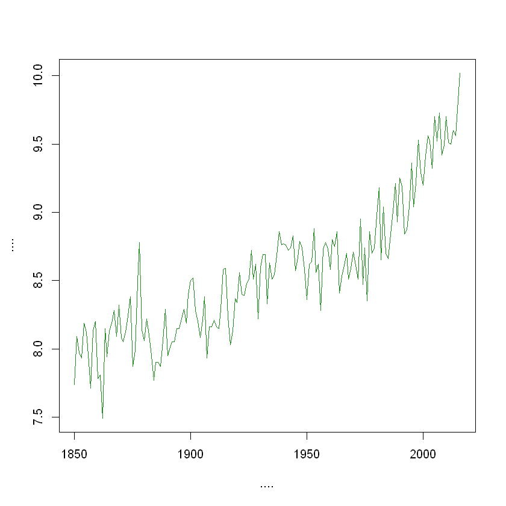
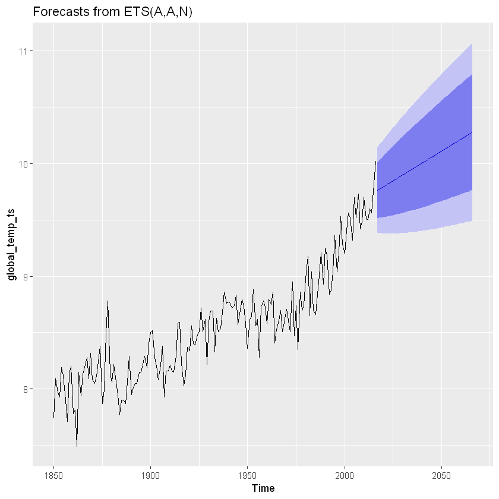

# Predict Average Global Temperature over Time
<p>We've seen that notebooks can display basic objects such as numbers and strings. But notebooks also support the objects used in data science, which makes them great for interactive data analysis!</p>
<p>For example, below we create a data frame by reading in a <code>csv</code>-file with the average global temperature for the years 1850 to 2016. If we look at the <code>head</code> of this data frame the notebook will render it as a nice-looking table.</p>


```R
# Reading in the global temperature data,data
global_temp <- read.csv("datasets/global_temperature.csv")

# Take a look at the first datapoints
head(global_temp)
```


<table>
<thead><tr><th scope=col>year</th><th scope=col>degrees_celsius</th></tr></thead>
<tbody>
	<tr><td>1850</td><td>7.74</td></tr>
	<tr><td>1851</td><td>8.09</td></tr>
	<tr><td>1852</td><td>7.97</td></tr>
	<tr><td>1853</td><td>7.93</td></tr>
	<tr><td>1854</td><td>8.19</td></tr>
	<tr><td>1855</td><td>8.12</td></tr>
</tbody>
</table>


## Plot Temperature Data
Tables are nice but — as the saying goes — "a plot can show a thousand data points". Notebooks handle plots as well and all plots created in code cells will automatically be displayed inline.

Let's take a look at the global temperature for the last 150 years.


```R
# Plotting global temperature in degrees celsius by year.
plot(global_temp$year, global_temp$degrees_celsius, 
     type = "l", col = "forestgreen", 
     xlab = "....", ylab = "....")
```





## ETS Model

Tables and plots are the most common outputs when doing data science and, as these outputs are rendered inline, notebooks works great not only for doing a data analysis but also for showing a data analysis. A finished notebook contains both the result and the code that produced it. This is useful when you want to share your findings or if you need to update your analysis with new data.

Let's add some advanced data analysis to our notebook! For example, this (slightly complicated) code forecasts the global temperature 50 years into the future using an exponential smoothing state space model (ets).

Note: Global temperature is a complex phenomenon and exponential smoothing is likely not a good model here. This is just an example of how easy it is to do (and show) complex forecasting in a Jupyter notebook.


```R
library(forecast)
library(ggplot2)

# Converting global_temp into a time series (ts) object.
global_temp_ts <- ts(global_temp$degrees_celsius, 
                     start = global_temp$year[1])

# Forecasting global temperature 50 years into the future 
# using an exponential smoothing state space model (ets).
temperature_forecast <- forecast( ets(global_temp_ts), h = 50)

# Plotting the forecast
autoplot(temperature_forecast)
```




